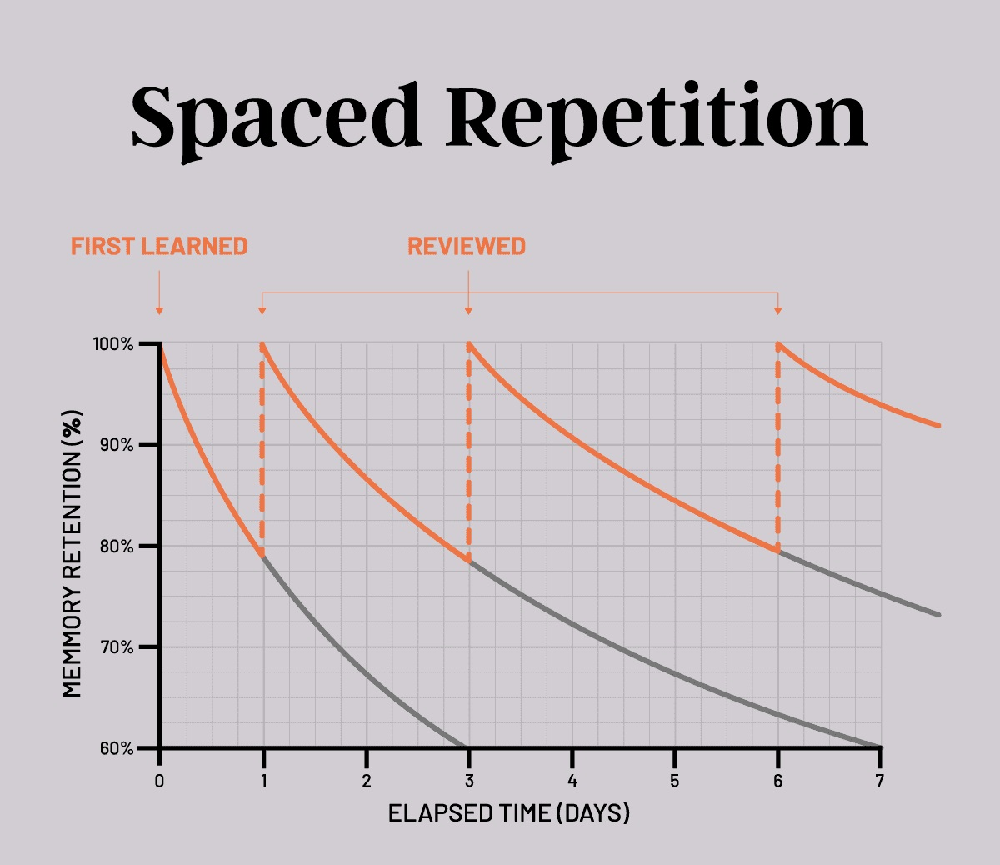
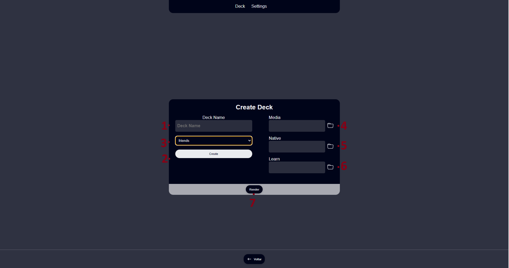

# Lang

Lang will make you learn languages ​​in a fun and non-tiring way, use your favorite series / film and create a pleasant learning environment.

## What does it do

Spaced repetition is a powerful method for optimizing learning by allowing students to return to a topic after a set amount of time . With these breaks, the brain is able to process the information and fix the content, which speeds up the process and generates greater efficiency.

# How to use

just install the program.

download your favorite series or movie and the subtitles of the language you want to learn and your native language.

> to avoid mistakes open the (series/movies) and see for a few seconds if the speech is synchronized with the subtitle, both native and the one you want to learn

### How to create my own deck

- 1-2 and 3: you need to give a name to your deck, so 1 - 2 to create and 3 to select.

- 4: series / movie file;
- 5 and 6: 5 would be your native language and 6 which would you want to learn.
- 7: to render you click on render and do not close the program.

  ### How do I know if it has finished rendering

  no matter which screen you are on, deck or create deck, you will have a green notification indicating that you finished on the right for 5s.

  If 5 seconds have passed, the deck page will show the total on the deck and has the button (open folder) and select all (CTRL + A) and see the total file in the folder, remembering that there are 2 files by default in the folder (settings and decklang), then it would be total - 2.

  ### how to save my progress

  click the open folder button and copy the langDeck.json file to anywhere you want to save.

  ### how to use my saved progress

  click on the button (open folder) and paste the file (in this you will only have the progress text) now you only need the video file.

  - select your series (number 3) in the "create deck"(you won't need to create from 0) and select the video file (number 4) from your series / movie and click on render and that's it.
